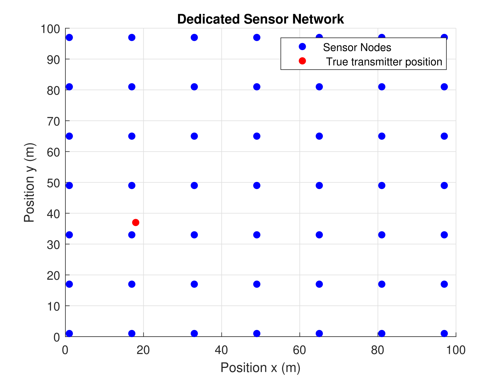
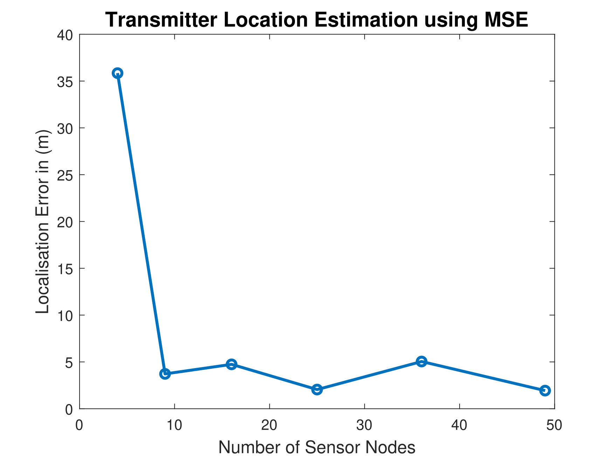
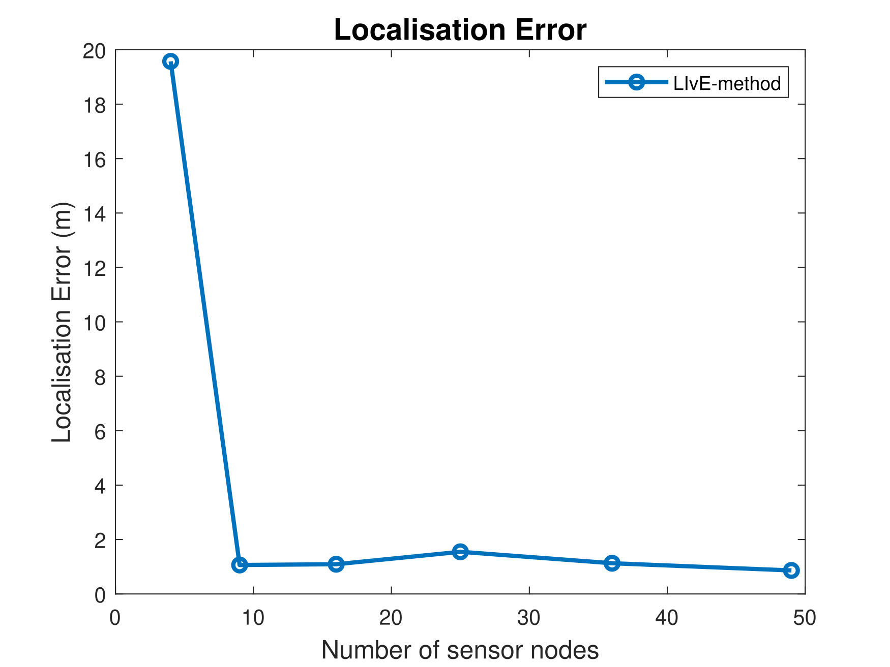
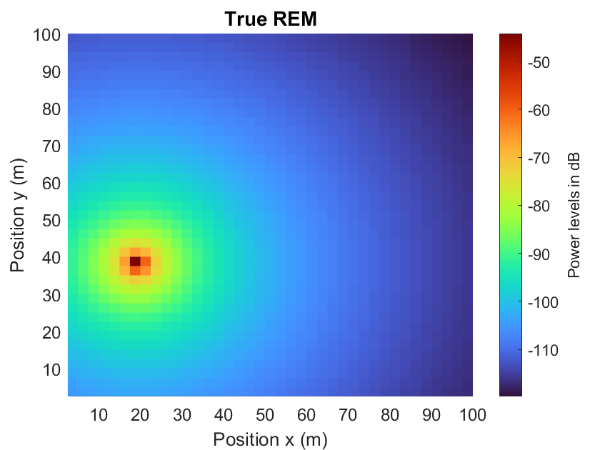
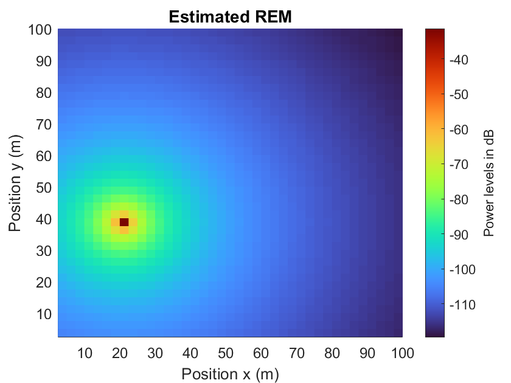
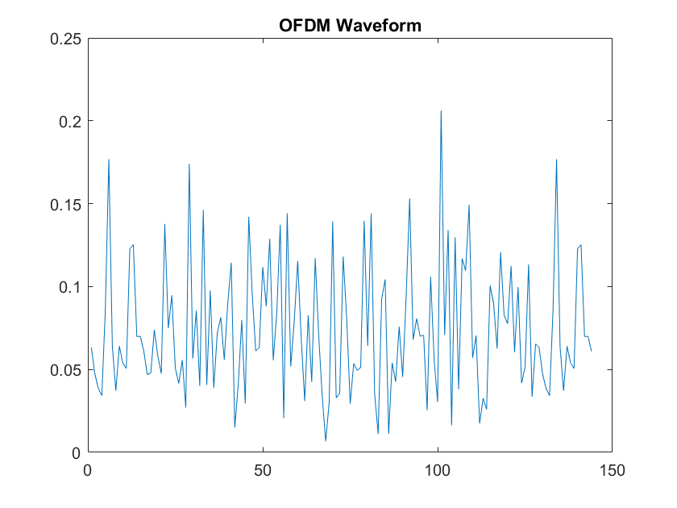
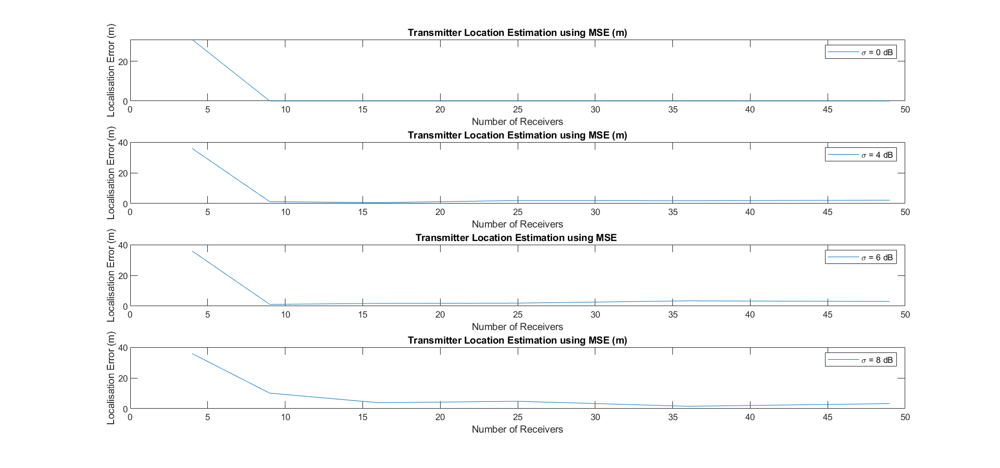

# RSS-based localization: using distributed spectrum sensing for 5G networks

Master's thesis evaluating RSS-based active-transmitter localization (MSE and LIvE
methods) and radio environment map (REM) construction from a distributed
spectrum-sensing network, extended to a 5G-NR-style OFDM transmit waveform and
spatially correlated shadowing.


## Overview

Wireless sensor networks increasingly need to answer a basic question about their
radio environment: where is a given transmitter, and how does its power spread
across the area of interest? Received signal strength (RSS) — already exposed by
virtually every radio as the RSSI reading, with no extra hardware — is an
attractive way to answer it, unlike angle-of-arrival or time-of-arrival methods that
need directional antennas or tight clock synchronization across sensors. This
thesis studies that problem in a concrete setting: a dedicated grid of spectrum
sensors performing distributed spectrum sensing captures RSS measurements from a
single static transmitter, and a fusion center uses those measurements to (1)
estimate the transmitter's position and (2) reconstruct a radio environment map
(REM) — a power map of the area — from that estimate.

REM construction matters beyond the immediate localization problem. It underpins
cognitive radio's ability to characterize occupied spectrum, and — as the thesis's
literature review (Chapter 3) covers in some depth — it has since become relevant
well beyond cognitive radio for 5G/6G use cases: spectrum sharing and interference
avoidance, mmWave and high-speed-rail Doppler-shift compensation, V2X safety and
physical-layer security, and UAV-assisted coverage in areas with degraded
terrestrial connectivity. Localizing the active transmitter is treated here as the
foundational step that makes an accurate REM possible in the first place.

The thesis's specific contribution is to implement and compare two RSS-based
localization algorithms side by side under an identical system model — a
closed-form mean-squared-error (MSE) least-squares estimator, and LIvE, a
constrained nonlinear optimization solved via `fmincon` — across a uniform sensor
grid swept from 4 to 49 nodes, under both independent log-normal shadowing and
spatially correlated (Gudmundson) shadowing. It then extends the usual "static
transmit power" assumption used throughout the localization literature by
generating an actual OFDM waveform matched to 5G NR numerology-0 parameters as the
transmitted signal, and finally feeds the localization output back into an
RSS-interpolated REM, comparing the true and reconstructed power maps with and
without additive shadowing noise. Most prior work the thesis surveys addresses
either localization or REM construction, not both in one evaluated pipeline; this
is the gap the thesis positions itself against.

## Methodology

**System model.** A single static transmitter sits at a fixed position (18 m, 37 m)
inside a 100 m × 100 m area of interest. Sensors are placed on a uniform grid swept
over {4, 9, 16, 25, 36, 49} nodes. RSS at each sensor follows a log-distance path
loss model with path loss exponent 3.5, reference distance 2 m, carrier frequency
3.7 GHz, and transmit power of 0.1 W, plus a log-normal shadowing term (standard
deviation 8 dB by default); RSS is averaged over 100 shadowing realizations per
sensor to suppress noise before localization.

**Localization algorithms** (`code/localization/`):
- *MSE / least squares* (`Corrected_mse_code.m`, `mse_test.m`, `test_grid.m`) —
  linearizes the nonlinear RSS-vs-distance relationship by differencing pairs of
  sensor equations, forming a system `A·θ = Y` from combinations of 4 sensors at a
  time, and solving for the transmitter position and reference path loss via the
  Moore–Penrose pseudo-inverse, averaged over repeated experiments and sensor
  combinations to average out shadowing noise.
- *LIvE* (`LIvE_algorithm.m`) — poses the same linearized system as a
  constrained optimization (an equality constraint coupling the position and
  reference-path-loss unknowns via a Lagrangian dual), using all available sensors
  at once, and solves it with MATLAB's `fmincon` (interior-point algorithm).
- An *adaptive iterative* gradient-descent variant (`Adaptive_iteration_method.m`,
  `mysteepest.m`) based on a method described in the literature was implemented but
  ultimately not carried forward into the reported results, because the source
  paper did not specify the exact parameters needed to reproduce it reliably.

**Correlated shadowing** (`code/spectrum_sensing/calculate_rss.m`,
`rss_measurements.m`) — models spatially correlated shadowing between sensor links
using the Gudmundson exponential correlation model (covariance decaying with
inter-sensor distance over a decorrelation distance), swept over shadowing standard
deviation σ = 0, 4, 6, 8 dB, and compared against the independent (i.i.d.)
log-normal baseline.

**OFDM waveform extension** (`code/ofdm/ofdm.m`,
`code/spectrum_sensing/rss_measurements_ofdm.m`) — replaces the static transmit
power assumption with an actual generated OFDM signal (128 subcarriers, 4-QAM,
16-sample cyclic prefix, 28 OFDM symbols — a ~2 ms observation window matching 5G NR
numerology 0), built with MATLAB's `ofdmmod`/`qammod`, and re-runs the MSE
localization pipeline against it.

**REM construction** — rather than a separate geostatistical interpolation step,
the thesis's own pipeline reconstructs the REM by directly evaluating the fitted
path-loss model (using either the true or the MSE-estimated transmitter position)
over a 40×40 sample grid across the 100 m × 100 m area, comparing the resulting true
and estimated power maps with and without additive shadowing noise. A separate,
third-party geostatistics toolkit implementing kriging and inverse-distance
weighting (`code/third_party/REMEstimate/`) was present in the project as reference
material but is not called by any of the author's own scripts — see
[Third-party code](#third-party-code) below.

**Evaluation metric.** Euclidean localization error (m) between the true and
estimated transmitter position, plotted against the number of deployed sensors.

## Key Results

All figures below are the author's own curated final results from
[`results/figures/`](results/figures/); captions describe only what is directly
shown or stated in the thesis text.

**Sensor deployment scenario.** The 49-sensor configuration of the uniform grid
sweep, with the true (static) transmitter marked at (18 m, 37 m):



**MSE localization accuracy.** Localization error falls sharply from roughly 36 m
at 4 sensors to under 5 m from 9 sensors onward, with little further improvement
past about 25 sensors in this 100 m × 100 m area — the thesis reports the MSE
method localizing the transmitter to "under 5 meters" once enough sensors are
deployed:



**LIvE localization accuracy.** The constrained-optimization LIvE method converges
to noticeably tighter accuracy — close to 1 m — from 9 sensors onward, at the cost
of substantially higher runtime than the closed-form MSE solution (the thesis's
stated reason for preferring MSE for the downstream REM-construction step):



**REM reconstruction.** True vs. MSE-estimated radio environment map for the
noise-free case, both rendered on the same colour scale. The reconstructed map
reproduces the true map's peak location and spatial roll-off closely:

<table>
<tr>
<td></td>
<td></td>
</tr>
</table>

**OFDM transmit waveform.** The generated 128-subcarrier, 4-QAM OFDM signal (16-sample
cyclic prefix, 28 symbols) used in place of a static transmit power for the 5G-NR-style
extension of the system model:



Using this OFDM signal as the transmitted waveform, the thesis reports the MSE
method reaching localization error under 1 m — close to centimeter-level precision
— once 9 or more sensors are deployed, notably better than the same method against
a static transmit-power signal. The thesis is explicit that the exact cause of this
improvement was not established and is flagged as future work rather than a fully
explained result.

**Correlated shadowing.** MSE localization error vs. number of sensors under the
Gudmundson spatially correlated shadowing model, swept over shadowing standard
deviation σ = 0, 4, 6, 8 dB (each panel one σ value, shared axes). Higher shadowing
correlation among nearby sensors visibly degrades accuracy, particularly at low
sensor counts; averaged over 25 experiments, the thesis reports MSE localization
error increasing by roughly 2 m as σ increases from 0 to 8 dB:



## Repository Structure

```
rss-localization-5g-spectrum-sensing/
├── README.md
├── LICENSE                          MIT (author's own code only — see License below)
├── .gitignore
├── code/
│   ├── Readme.txt                     Author's original codebase notes (verbatim)
│   ├── localization/                 RSS-based transmitter localization algorithms
│   │   ├── Corrected_mse_code.m         MSE / least-squares method (compact form)
│   │   ├── mse_test.m                   MSE method + REM reconstruction, full scenario
│   │   ├── test_grid.m                  Sensor-grid placement experiments incl. OFDM toggle
│   │   ├── LIvE_algorithm.m             LIvE method (fmincon-based constrained optimization)
│   │   ├── Adaptive_iteration_method.m  Exploratory gradient-descent variant (not used in results)
│   │   ├── mysteepest.m                 Generic steepest-descent linear solver helper
│   │   ├── RSS_kriging.m                Early draft script — see note below
│   │   └── transmitter_location_LSS.m   Early draft script — see note below
│   ├── spectrum_sensing/             RSS generation, shadowing models, energy detection
│   │   ├── calculate_rss.m
│   │   ├── rss_measurements.m
│   │   ├── rss_measurements_ofdm.m
│   │   └── SS_energy_detection.m
│   ├── ofdm/
│   │   └── ofdm.m                       5G-NR-style OFDM waveform generator
│   ├── analysis/                     Post-hoc plotting from saved results
│   │   ├── plotLivE.m
│   │   └── untitled3.m                  Correlated-shadowing comparison plots
│   └── third_party/                  Not the author's own code — see NOTICE.md
│       ├── NOTICE.md
│       ├── ofdm_trx.m                   Generic OFDM demo (Baher Mohamed)
│       └── REMEstimate/                 Geostatistics toolkit (Schwanghart, D'Errico)
│           ├── NOTICE.md
│           └── *.m
├── results/
│   ├── figures/                      Curated final result plots (source of the images above)
│   │   ├── MSE/
│   │   ├── Live/
│   │   └── ...                          sensor grids, OFDM, correlated-shadowing plots
│   └── data/                         Saved simulation outputs (.mat)
├── report/
│   ├── RSS_Based_Localization_using_Distributed_Spectrum_Sensing_for_5G_Networks.pdf
│   └── presentations/                 Defense and kickoff slide decks
├── references/
│   ├── references.md                  Full citation list
│   ├── rem/
│   ├── shadowing-correlations/
│   ├── spectrum-sensing/
│   ├── distributed-spectrum-sensing/
│   └── ofdm-and-general/
└── notes/                             Author's working notes, as kept during the thesis
    ├── Notes.txt
    ├── Possible_questions.txt
    └── Report Structure.txt
```

**A note on code completeness.** Not every script in `code/localization/` is
polished. `RSS_kriging.m` — despite its name — does not implement kriging; it is a
short multilateration script left over from the project's earliest exploration,
and it references a data file and variable names that are not defined anywhere
else in the codebase, so it will not run as-is. `transmitter_location_LSS.m` was
recovered from an earlier project snapshot (it does not appear in the main project
folder) and has the same issue. Both are kept for transparency about the project's
actual development history rather than presented as finished, verified
contributions; the algorithms that produced the thesis's reported results are
`Corrected_mse_code.m` / `mse_test.m` / `test_grid.m` (MSE) and `LIvE_algorithm.m`
(LIvE), all of which run standalone.

## Getting Started

**Requirements:** MATLAB (developed and run with R2023a) plus:
- **Communications Toolbox** — `ofdmmod`/`ofdmdemod`, `qammod` (`code/ofdm/ofdm.m`,
  `code/spectrum_sensing/rss_measurements_ofdm.m`)
- **Optimization Toolbox** — `fmincon`, `optimoptions` (`code/localization/LIvE_algorithm.m`)
- **Statistics and Machine Learning Toolbox** — `mvnrnd`, `normrnd`, `pdist2`
  (correlated-shadowing generation throughout `code/spectrum_sensing/`)

**Running a main script.** Each script under `code/localization/` is self-contained
(it generates its own sensor grid and RSS measurements and ends by plotting
results), but calls helper functions from `code/spectrum_sensing/` by name — add
both folders to your MATLAB path first:

```matlab
addpath('code/localization', 'code/spectrum_sensing', 'code/ofdm');

mse_test          % MSE method: sensor grid, localization error, and REM reconstruction
LIvE_algorithm    % LIvE method: constrained-optimization localization
```

To reproduce the OFDM-based localization result (Key Results, above), open
`code/localization/test_grid.m` and swap which RSS generator is active: comment
out the default `rss_measurements(...)` call and uncomment the
`ofdm(...)`/`rss_measurements_ofdm(...)` pair above it. This mirrors how the
original research code actually toggled between the two transmit-signal models —
there is no command-line flag for it.

To regenerate the correlated-shadowing comparison plot without rerunning the full
simulation, copy `results/data/corr_noise_std_*.mat` alongside
`code/analysis/untitled3.m` (or adjust its `load(...)` paths) and run it directly.

## Report & Presentations

The full thesis document and slide decks are in [`report/`](report/):

- [`RSS_Based_Localization_using_Distributed_Spectrum_Sensing_for_5G_Networks.pdf`](report/RSS_Based_Localization_using_Distributed_Spectrum_Sensing_for_5G_Networks.pdf) — the final thesis (78 pages)
- [`presentations/`](report/presentations/) — `thesis_defense.pptx`, `thesis_defense_somecomments.pptx`, `MSM_aakarsh.pptx` (research seminar), `master_thesis_mid_term_defense.pptx`, and `AakarshThesisKickOff.pptx` (initial project proposal)

## References

See [`references/references.md`](references/references.md) for the full,
categorized citation list (papers on REM construction, shadowing correlation,
spectrum sensing, distributed spectrum sensing, and OFDM/general background), with
links to the corresponding PDFs under `references/`.

### Third-party code

Two pieces of code in this repository are not the author's own work and are kept
separate under `code/third_party/`:

- **`REMEstimate/`** — a geostatistics toolkit (variogram fitting and kriging
  interpolation) authored by **Wolfgang Schwanghart** (2010–2011, MATLAB File
  Exchange) and **John D'Errico** (`fminsearchbnd`, FEX #8277). It was present in
  the original project as reference material but is not called by any of the
  author's own localization or REM-construction scripts. Full detail and evidence
  in [`code/third_party/REMEstimate/NOTICE.md`](code/third_party/REMEstimate/NOTICE.md).
- **`ofdm_trx.m`** — a generic introductory OFDM tx/rx demo explicitly headed
  "Written By: Baher Mohamed" in the file itself; unrelated to the thesis's actual
  128-subcarrier OFDM model in `code/ofdm/ofdm.m`. Detail in
  [`code/third_party/NOTICE.md`](code/third_party/NOTICE.md).

## Author

**Aakarsh Dhariwal** — Friedrich-Alexander-Universität Erlangen-Nürnberg (FAU)
Master's Thesis, Chair of Electrical Smart City Systems
Supervisors: MSc. Victor Shatov, Prof. Dr.-Ing. Norman Franchi
Submitted October 2023

## License

The author's own code in `code/` (excluding `code/third_party/`) is released under
the [MIT License](LICENSE).

- `code/third_party/` keeps its original authorship and is included for
  non-commercial, academic, and portfolio purposes only — see
  [`code/third_party/NOTICE.md`](code/third_party/NOTICE.md) and
  [`code/third_party/REMEstimate/NOTICE.md`](code/third_party/REMEstimate/NOTICE.md).
  No original license file accompanied this code, so if you intend to reuse it,
  obtain it directly from the original sources credited there.
- `report/` (thesis document and slide decks) remains the intellectual property of
  the author and FAU, included here for portfolio and reference purposes only.
- `references/` (third-party papers) retain their original copyright and are
  included for context only — see [`references/references.md`](references/references.md).
